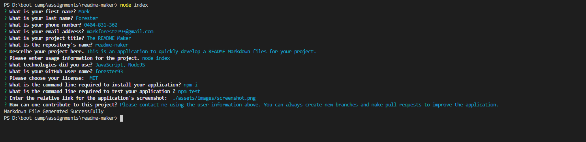

# The README Maker.

## License

[](https://opensource.org/licenses/MIT)

## Contents

• [License](#license)
• [Description](#description)
• [Pre-requisites](#pre-requisites)
• [Usage](#usage)
• [Installation](#installation)
• [Technologies](#technologies)
• [Links](#links)
• [Questions](#questions)
• [Contributing](#contributing)

## Description

This is an application to quickly develop a README Markdown files for your projects so that you can have more time coding.

## Pre-requisites

• Git Bash or VSCode Command line or Similar installed on your system.  
• NodeJS installed on your system.

### Usage

To run the application you need to run the following command line:

```
node index
```

### Installation

To install the application you need to run the following command line:

```bash
npm i
```

### Technologies

• JavaScript  
• NodeJS

## Links

### Link to the Github Repository

[The README Maker Github Repo](https://github.com/forester93/readme-maker/)

### Video Tutorial to Run the Application

[Video Tutorial to Run the Application](https://drive.google.com/file/d/1X3BBRRSoSYuGzYdHcTewfOAO3Ur8Km-6/view?usp=sharing)

### Sample of a README Generated by this Application

[README Sample Generated by this Application](./assets/README-sample.md)

### Screenshot of the Application




## Questions

You can reach out to me over one of the following for any questions about this application.

| Name          | Email                    | Phone Numer  | GitHubProfile                                                  |
| ------------- | ------------------------ | ------------ | -------------------------------------------------------------- |
| Mark Forester | markforester93@gmail.com | 0404-831-362 | [Mark Forester Github Profile](https://github.com/forester93/) |

## Contributing

Please contact me using the user information above. You can always create new branches and make pull requests to improve the application.
