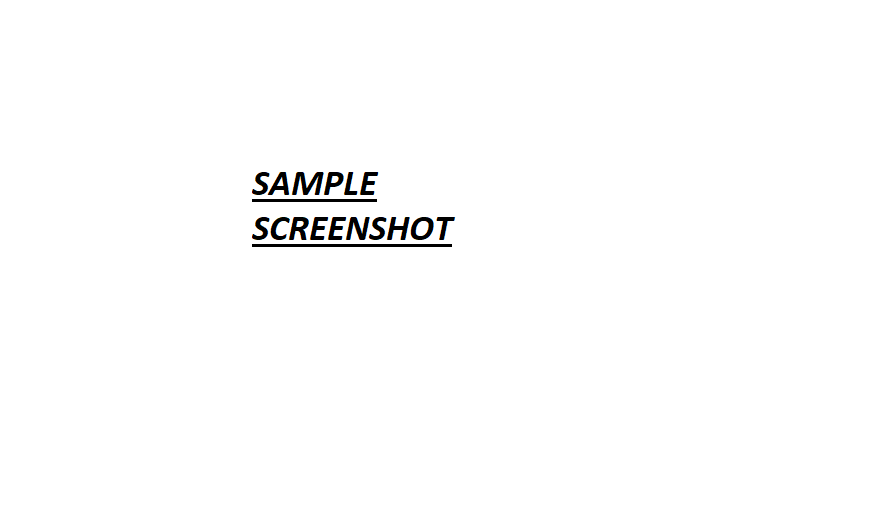

# Sample Readme.

## License

[](https://opensource.org/licenses/MIT)

## Contents

• [License](#license)
• [Description](#description)
• [Usage](#usage)
• [Installation](#installation)
• [Technologies](#technologies)
• [Test](#test)
• [Links](#links)
• [Questions](#questions)
• [Contributing](#contributing)

## Description

This is a sample project to test out the functionality of the README Maker Application.

### Usage

To run the application you need to run the following command line:

```
node index
```

### Installation

To install the application you need to run the following command line:

```bash
npm i
```

### Technologies

• JavaScript  
• NodeJS

### Test

To test the application you need to run the following command line:

```bash
npm test
```

## Links

### Link to the Deployed Application

[Sample Readme Deployed Webpage](https://forester93.github.io/sample-readme/)

### Link to the Github Repository

[Sample Readme Github Repo](https://github.com/forester93/sample-readme/)

### Screenshot of the Application



## Questions

You can reach out to me over one of the following for any questions about this application.

| Name          | Email                    | Phone Numer  | GitHubProfile                                                  |
| ------------- | ------------------------ | ------------ | -------------------------------------------------------------- |
| Mark Forester | markforester93@gmail.com | xxxx-xxx-xxx | [Mark Forester Github Profile](https://github.com/forester93/) |

## Contributing

Contact me on the above.
